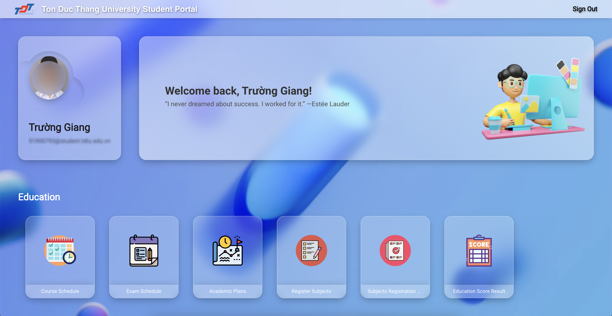

# STD Student Portal Glassmorphism Theme Extension

Introducing the brand new UI design for **Ton Duc Thang University Student Portal**. I have worked tirelessly to create a user-friendly and visually appealing interface that caters to the needs of students. The new design features a clean and minimalist layout that is easy to navigate, with intuitive icons and clear labeling. The color scheme is bright and cheerful, creating a welcoming and engaging atmosphere for users. The use of **glassmorphism** adds depth and texture to the design, making it visually striking and unique. The color scheme is kept minimal, with shades of blue and white to create a sense of calm and focus.

## Screenshot

Thank you, hope you enjoy!
